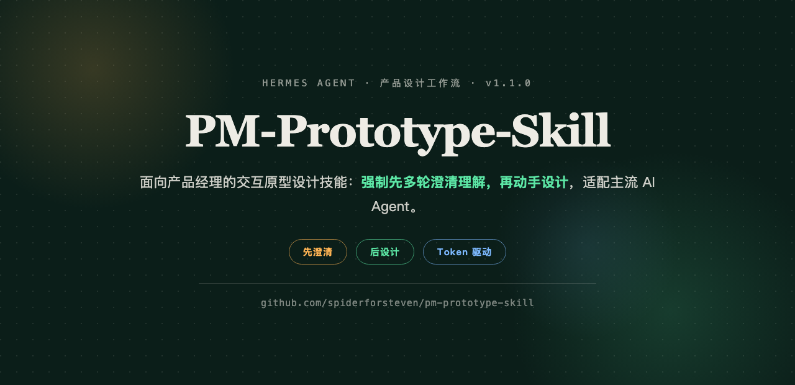

<p align="center">
  
</p>

<div align="center">


</div>

---

## 这是什么

面向**产品经理**的交互原型设计技能（AI Agent 工作流）：你通过「设计软件 MCP 链接 / 设计稿截图 + 优化诉求 / 纯文字诉求」发起需求，AI 按强制协议执行——**先多轮澄清理解，再基于设计 token 出稿**。

> 核心铁律：**未充分理解交互细节前，禁止出稿。** 宁可多问三轮，不可早出一版错的。

## 为什么需要它

LLM 驱动的原型设计，失败往往出在**理解阶段**，而不是渲染阶段。以下是真实事故：

| 事故 | 问题 |
|---|---|
| 模式切换卡片看起来像普通设置行 | AI 没意识到「Smart care」是 4 个种植策略的入口 |
| 手动模式藏在设备设置里 | 被误读为平级模式，而非隐藏的进阶模式 |
| 设备参数混进模式卡片 | 水位、光照是**客观状态**，应独立常显，而非模式属性 |
| 一个概念两个名字 | 「AI mode」和「Smart care」同屏 = 认知负担 |

解法被固化为强制协议：**复述 → 澄清 → 确认 → 设计**。

## 5 步流程

| 步骤 | 名称 | 内容 |
|---|---|---|
| 01 | **复述理解** | 输出页面结构 + 交互要点 + 不确定项清单（永不跳过） |
| 02 | **逐项澄清** | 一次一问，由 60+ 问题库 + 四种提问哲学驱动 |
| 03 | **共识确认** | 你确认最终理解后，才开始设计 |
| 04 | **执行设计** | **先问设计 token**（你自备优先）→ 无则用预置 → 出稿 |
| 05 | **交付** | 线框图 / 高保真原型 / 评审报告（L2 交付前逐项过 `references/交付前质量检查表.md`） |

## 提问哲学（四种）

- **苏格拉底式追问**——从答案反推前提，挖出你没说出口的假设。*「你希望参数独立，是因为切换模式时不应该隐藏水位信息？」*
- **对抗式审查**——替你找茬。*「一个完全不懂的用户能找到这个入口吗？」*
- **交互断点扫描**——拆任务路径找卡点：找不到入口 / 看不到状态 / 无法撤销。
- **友好性检查**——可撤销、防误触、100ms 内反馈、命名一致、渐进披露。

理论依据：Nielsen 10 大可用性启发式、Hick 定律、Fitts 定律、心智模型。

## 设计 Token（可替换）

每次进入设计前，AI 会先问：**「你有自己的设计 token 吗？」**

- **有** → 上传你的 token（粘贴值 / 上传文件 / 提供品牌官网），AI 全量替换并校验 WCAG 对比度
- **没有** → 使用预置 token（`references/design-tokens.md`：欧美 App 通用默认——Apple HIG/Uber/BirdBuddy 基线，中性灰阶 + 占位系统蓝 + 系统语义色 + 深浅双主题）
- **反例红区**（默认禁止做出国内促销 UI 观感）：高饱和促销渐变 / Banner 轮播 / 金币券红包贴纸 / 红点轰炸 / 五颜六色图标（对照表见 design-tokens.md）

## 适配主流 AI Agent

本技能不绑定单一工具，`AGENTS.md` 提供各平台接入方式：

| Agent | 接入 |
|---|---|
| Hermes Agent | 复制到 `~/.hermes/skills/`，工具自动发现 |
| Cursor | `.cursor/rules/pm-prototype.mdc` 引用 AGENTS.md |
| Claude Code | `CLAUDE.md` 追加引用 |
| Codex / Cline | 读 AGENTS.md 或复制到项目根目录 |

## 仓库结构

```
├── SKILL.md                      # 主协议（Hermes skill 格式，通用协议见 AGENTS.md）
├── AGENTS.md                     # 主流 AI Agent 接入层（Cursor/Claude Code/Codex/Cline）
├── references/
│   ├── 问题库全表.md             # 完整问题库：60+ 问 + 对抗式/断点/友好性清单 + 苏格拉底句式
│   ├── design-tokens.md          # 预置设计 token（欧美 App 通用默认 + 反例红区表）
│   └── 交付前质量检查表.md       # L2 交付前 6 块可勾清单（流程/视觉/交互/深浅主题/布局/无障碍）
├── docs/
│   └── 使用说明.md               # 可分发使用说明（含占位符表）
├── assets/
│   └── hero.png                  # README 横幅
└── README.md
```

## 安装（Hermes Agent）

```bash
cp -r pm-prototype-skill ~/.hermes/skills/product-management/
hermes skills list | grep prototype
```

## 使用示例

> 「这个 MasterGo 链接的设计稿，我想优化模式切换交互，出个高保真原型」

AI 会：通过 MCP 读取设计稿 DSL → 复述页面结构 → 一次一问（模式是并列还是嵌套？参数随模式变吗？入口要多显眼？）→ 确认 → 问设计 token → 输出可交互 HTML 原型 → 按交付前质量检查表逐项自检。若设计稿打不开或无权限，走 §2.1 工具降级路径，绝不硬编结构假装读到。

## 更新日志

- **v1.4.0**（2026-09-03）合并 UI UX Pro Max：新增 `references/交付前质量检查表.md`；评审优先级（Accessibility / Touch 为 CRITICAL）；`related_skills` 关联 ui-ux-pro-max（风格/调色板/UX 指南可现场查询）
- **v1.3.0**（2026-09-03）新增 §2.1 输入异常与工具降级：读稿失败降级路径 / 拒绝对抗式催稿 / 交付验证失败处理 / 多来源冲突拍板
- **v1.2.0**（2026-09-03）默认 token 改为欧美 App 通用风格（Apple HIG / Uber / BirdBuddy），design-tokens.md 重写 + 反例红区表
- **v1.1.0**（2026-08-31）适配主流 AI Agent（AGENTS.md），支持自定义设计 token

## License

MIT
